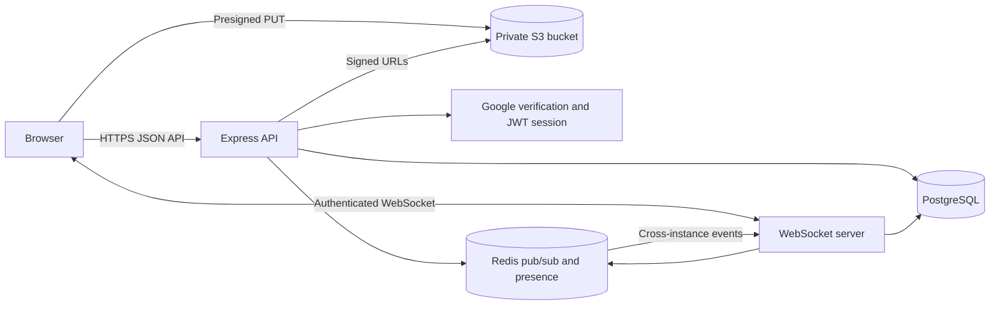

# GSQUAD

GSQUAD is a real-time messaging application for private conversations and invitation-only groups. It combines a React client, an Express API, PostgreSQL persistence, Redis-backed real-time fan-out, WebSockets, Google authentication, and private S3-compatible media storage.

## What the system supports

- Google sign-in and cookie-based sessions
- User display names and generated initial avatars
- Friend requests, acceptance, removal, and blocking
- Direct messages restricted to accepted friends
- Invitation-only groups with owner-controlled membership
- Real-time messages, typing indicators, presence, and read state
- Replies, pins, editing, deletion, search, notifications, and archives
- Private photo and video attachments through presigned uploads
- Dark and light appearance modes

## Architecture at a glance



The browser uses the API for durable operations and a WebSocket for immediate updates. PostgreSQL is the source of truth. Redis distributes ephemeral events and presence state. Media bypasses the API and moves directly between the browser and private object storage.

See [System design](docs/system-design.md) for detailed component, data, authorization, deployment, and sequence diagrams.

## Repository layout

```text
chatApp/
├── client/                  React and Vite browser application
│   └── src/
│       ├── components/      Messaging and account interface
│       ├── hooks/           Auth, conversation, presence, and socket state
│       └── services/api.js  HTTP client boundary
├── server/                  Express, WebSocket, Redis, and storage services
│   ├── middleware/          Session authentication
│   ├── prisma/              Schema, migrations, and seed data
│   ├── routes/              HTTP feature boundaries
│   ├── validation/          Zod request schemas
│   ├── redis.js             Pub/sub and presence adapter
│   ├── storage.js           S3-compatible storage adapter
│   └── websocket.js         Authenticated real-time connections
└── docs/                    Architecture documentation
```

## High-level behavior

### Authentication

The client receives a Google credential and sends it to `POST /auth/google`. The server verifies it with Google, upserts the user, signs a JWT, and stores that token in an HTTP-only session cookie. Protected HTTP routes and WebSocket upgrades derive the current user from this session.

### Conversations

A conversation is either `DIRECT` or `GROUP`:

- A direct conversation has a stable `directKey` for its two users and can be created only between accepted friends.
- A group records its creator. Only the creator can add people or delete the group. Membership determines who can read or write messages.
- Per-user membership stores role, archive state, notification preference, and last-read position.

### Messaging and real-time delivery

When a message is sent, the API validates the request, confirms membership, enforces direct-message friendship rules, writes the message to PostgreSQL, and publishes a recipient-scoped event to Redis. Every server instance subscribes to Redis and forwards matching events to its connected WebSocket clients.

The client inserts an optimistic message immediately. The durable server response replaces it. If delivery fails, the optimistic item becomes retryable rather than silently disappearing.

### Friends and blocking

Friendship records move from `PENDING` to `ACCEPTED`. Direct messaging is allowed only after acceptance. Removing a friend removes the shared direct conversation. Blocking removes the friendship and direct conversation while intentionally leaving future requests looking pending to the blocked user.

### Notifications

Durable notifications live in PostgreSQL and survive reconnects. Friend requests and group invitations are derived from their source records. Clicking a saved notification removes it, and the panel supports clearing all durable notifications.

### Attachments

The attachment flow uses private object storage:

1. The client selects an allowed image or video and creates a local preview.
2. `POST /attachments/presign` verifies conversation membership, type, and size.
3. The server returns a five-minute S3-compatible upload URL and generated object key.
4. The browser uploads bytes directly to storage and reports progress.
5. The client sends the message with the object metadata.
6. The API verifies the uploaded object before saving the attachment record.
7. Message responses contain a one-hour signed viewing URL.

The API never buffers the media body. Images are limited to 15 MB; videos are limited to 250 MB. Supported formats are JPEG, PNG, WebP, GIF, MP4, WebM, and QuickTime.

## Lower-level design

### Client state

`useConversations` owns the conversation list, selected conversation, message pages, optimistic writes, retries, unread counts, and WebSocket reconciliation. `MessageInput` owns the draft, reply target, selected attachment, preview, upload progress, and submission state. Text drafts are stored locally per conversation.

### API boundaries

- `auth.js`: Google login, current session, logout
- `users.js`: current-user profile and user directory
- `friends.js`: requests, acceptance, removal, and blocks
- `conversations.js`: listing, creation, reads, renaming, and deletion
- `members.js`: members, roles, mute state, and archives
- `messages.js`: pages, creation, replies, edits, deletion, pins, and reactions
- `notifications.js`: durable notification listing and dismissal
- `search.js`: membership-scoped message search
- `attachments.js`: presigned upload authorization

All domain routes except login require authentication. Conversation operations additionally enforce membership, ownership, or friendship rules.

### Persistence model

- `User`: identity, profile, memberships, and social relationships
- `Friendship`: directed request with `PENDING` or `ACCEPTED` state
- `UserBlock`: blocker-to-blocked relationship
- `Conversation`: direct or group container
- `ConversationMember`: role, read position, mute, and archive state
- `Message`: text, sender, conversation, reply, edit, and deletion data
- `MessageAttachment`: private object key and media metadata
- `MessageReaction`: per-user emoji reaction
- `MessagePin`: one pin record per message
- `Notification`: durable mention or friend-acceptance activity

Conversation deletion explicitly clears dependent records. Attachment objects are also removed from storage when their message or conversation is deleted.

### Pagination, presence, and typing

Messages use ID-cursor pagination in pages of 30 and are returned chronologically. Client merging de-duplicates optimistic, HTTP, and WebSocket versions.

Redis stores a connection count per user so multiple tabs do not incorrectly mark someone offline. Typing signals are transient WebSocket events; the server verifies membership before distributing them and does not persist them.

## Local development

### Requirements

- Node.js
- PostgreSQL
- Redis
- A Google OAuth client ID
- Optional private S3-compatible bucket for attachments

### Start the server

```bash
cd server
cp .env.example .env
npm install
npx prisma migrate deploy
npx prisma generate
npm run dev
```

The server listens on `http://localhost:3001`.

### Start the client

```bash
cd client
npm install
npm run dev
```

The client runs on `http://localhost:5174`. `VITE_API_URL` can override the API origin.

## Environment variables

| Variable | Purpose |
| --- | --- |
| `DATABASE_URL` | PostgreSQL connection string |
| `REDIS_URL` | Redis connection string |
| `JWT_SECRET` | Signs authenticated session tokens |
| `GOOGLE_CLIENT_ID` | Verifies Google login credentials |
| `S3_REGION` | Storage region |
| `S3_BUCKET` | Private attachment bucket |
| `S3_ACCESS_KEY_ID` | Server-only storage identity |
| `S3_SECRET_ACCESS_KEY` | Server-only storage secret |
| `S3_ENDPOINT` | Optional alternative S3-compatible endpoint |
| `S3_FORCE_PATH_STYLE` | Optional compatibility mode for providers such as MinIO |

Never expose S3 credentials through `VITE_` variables or commit a populated `.env` file.

## S3 bucket configuration

Allow browser uploads from the development client:

```json
[
  {
    "AllowedOrigins": ["http://localhost:5174"],
    "AllowedMethods": ["PUT"],
    "AllowedHeaders": ["Content-Type"],
    "ExposeHeaders": ["ETag"],
    "MaxAgeSeconds": 3000
  }
]
```

The storage identity needs `s3:PutObject`, `s3:GetObject`, and `s3:DeleteObject` only within the configured bucket. Keep public access disabled.

## Security model

- HTTP-only cookies keep the session token out of client JavaScript.
- Every protected route verifies the signed session.
- Conversation access is membership-scoped.
- Group administration is owner-scoped.
- Direct messages require an accepted friendship.
- Search is limited to the user’s conversations.
- Upload keys are namespaced by conversation and user.
- Uploaded size and content type are verified before attachment.
- Upload URLs expire after five minutes; viewing URLs expire after one hour.

Before production, add CSRF protection, production CORS origins, secure cookie settings, rate limits, malware scanning, media transcoding, structured logging, monitoring, backups, and automated tests.

## Scaling path

The current boundaries support multiple API instances because durable state lives in PostgreSQL and real-time fan-out runs through Redis. A production deployment would place the client behind a CDN, run stateless API/WebSocket instances behind a load balancer, use managed PostgreSQL and Redis, and serve private attachments through signed URLs or a protected CDN.

Likely future additions include thumbnail generation, video transcoding, orphan-upload cleanup, push notifications, dedicated full-text search, and a transactional outbox for guaranteed database-to-event delivery.

## Validation

```bash
cd client
npm run lint
npm run build

cd ../server
node --check index.js
npx prisma validate
```

Prisma migrations are the authoritative database history and must be applied before starting a server against a new database.
