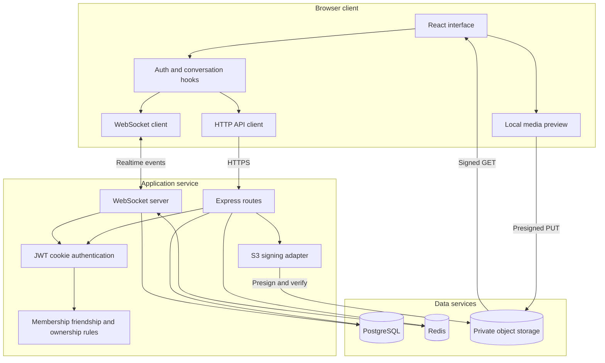
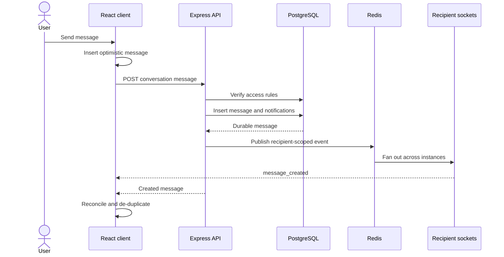
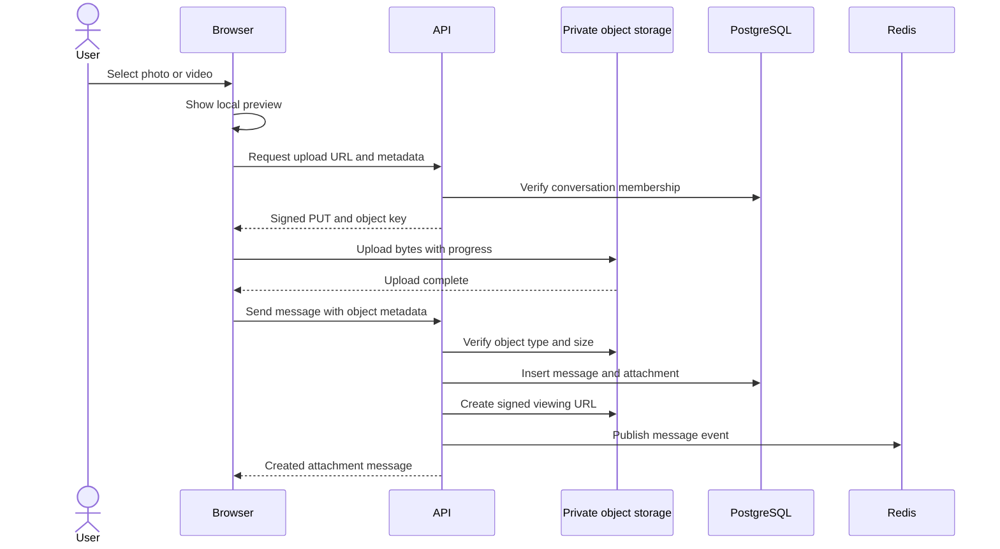
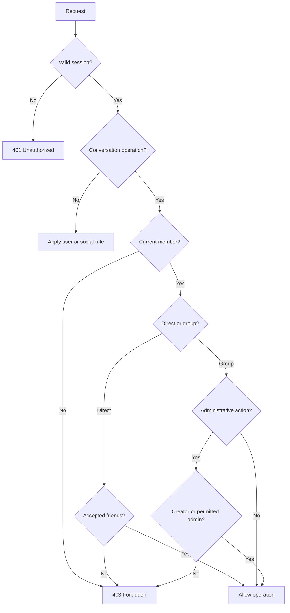
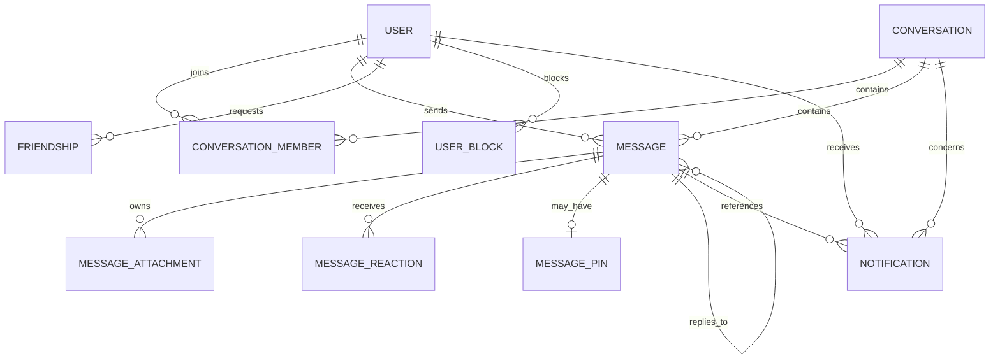
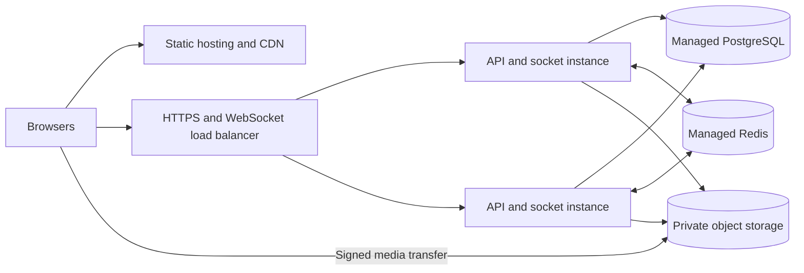

# GSQUAD system design

This document moves from the system boundary into the primary runtime, authorization, data, and deployment flows.

## Component architecture

## Text-message write path

## Attachment write path

## Authorization decisions

## Core data relationships

## Production deployment topology

API instances are stateless apart from their active socket connections. PostgreSQL remains authoritative, Redis connects instances for ephemeral delivery, and object storage carries media independently of application-server bandwidth.
